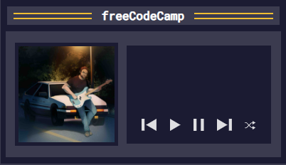
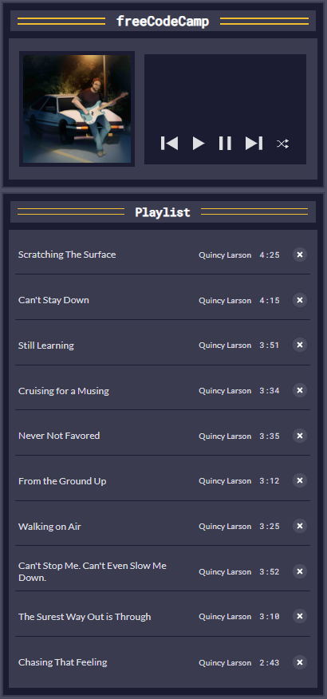
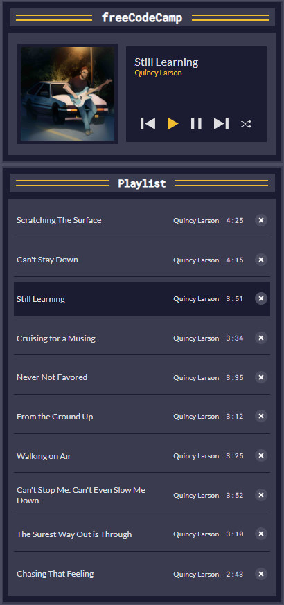
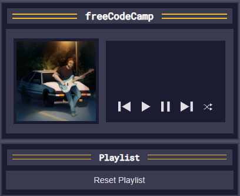

  

  
  
  

# FreeCodeCamp - Learn Basic String and Array Methods by Building a Music Player
Now let's learn some essential string and array methods like the find(), forEach(), map(), and join(). These methods are crucial for developing dynamic web applications.

In this project, you'll code a basic MP3 player using HTML, CSS, and JavaScript. The project covers fundamental concepts such as handling audio playback, managing a playlist, implementing play, pause, next, previous, and shuffle functionalities. You'll even learn how to dynamically update your user interface based on the current song.

  <table>
    <tr>
      <td align="center">
        <strong>
Music player
</strong>
        
      </td>
      <td align="center">
        <strong>
Music player and playlist
</strong>
        
      </td>
    </tr>
    <tr>
      <td align="center">
        <strong>
Playing a song
</strong>
        
      </td>
      <td align="center">
        <strong>
Empty playlist
</strong>
        
      </td>
    </tr>
  </table>

